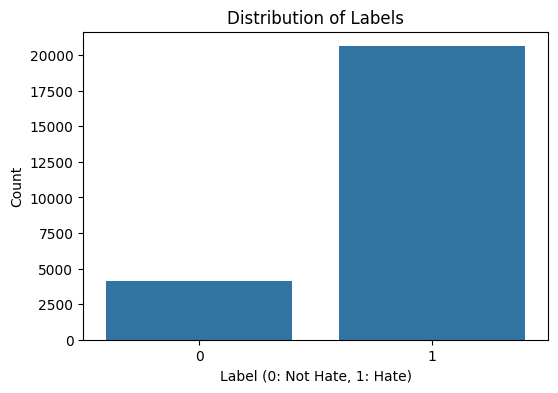
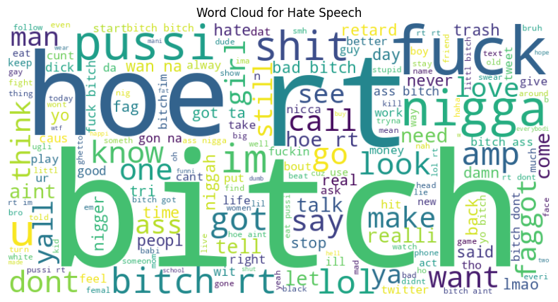

|       |                                   |
| ----- | --------------------------------- |
| Nama  | Zalfa Dewi Zahrani (312210316) |
| Kelas | TI.22.A.SE.1                      |
| Tugas | UTS Kecerdasan Buatan             |

# Dataset

Pilihan Dataset: Gunakan "Hate Speech and Offensive Language Dataset" dari Davidson et al. (tersedia di Kaggle atau GitHub: https://github.com/t-davidson/hate-speech-and-offensive-language). Alternatif, gunakan "ID Hate Speech Dataset" dari IndoBERT (tersedia di Hugging Face atau sumber lokal Indonesia: https://huggingface.co/datasets/indolem/indolem-hate-speech). Dataset ini memiliki minimal dua label: 0 (tidak mengandung ujaran kebencian) dan 1 (mengandung ujaran kebencian).

## Deskripsi Dataset:

Dataset Ujaran: Berisi tweet dalam bahasa Inggris dengan label 0 (tidak hate/offensive), 1 (offensive), dan 2 (hate speech). Untuk tugas ini, gabungkan label 1 dan 2 menjadi 1 (hate), dan 0 tetap 0.
ID Hate Speech Dataset: Dataset dalam bahasa Indonesia dengan label serupa (0 = bukan hate speech, 1 = hate speech).
Ukuran: Minimal 20.000 sampel untuk akurasi yang baik.
Cara Mendapatkan Dataset:
Unduh dari Kaggle (cari "Hate Speech and Offensive Language Dataset") atau GitHub.
Untuk ID dataset, gunakan Hugging Face: from datasets import load_dataset; dataset = load_dataset("indolem/indolem-hate-speech").
Simpan sebagai CSV atau load langsung ke Python. Pastikan kolom teks (misalnya 'tweet' atau 'text') dan label ('label').

# Preprocessing Teks

## Langkah-Langkah:

Case folding: Ubah semua teks ke huruf kecil.
Hapus tanda baca dan angka: Gunakan regex untuk membersihkan karakter non-alfabet.
Tokenisasi: Pecah teks menjadi kata-kata.
Stopword removal: Hapus kata-kata umum seperti "the", "is" (untuk Inggris) atau "dan", "yang" (untuk Indonesia).
Stemming/Lemmatization: Opsional, gunakan Porter Stemmer untuk Inggris atau Sastrawi untuk Indonesia.

```py
import pandas as pd
import re
import nltk
from nltk.tokenize import word_tokenize
from nltk.corpus import stopwords
from nltk.stem import PorterStemmer
from sklearn.model_selection import train_test_split
from sklearn.feature_extraction.text import TfidfVectorizer
from sklearn.linear_model import LogisticRegression
from sklearn.metrics import accuracy_score, precision_score, recall_score, f1_score, classification_report
import matplotlib.pyplot as plt
import seaborn as sns
from wordcloud import WordCloud

# Download necessary NLTK data
nltk.download('punkt')
nltk.download('stopwords')


# Step 1: Load Dataset
# Using Hate Speech and Offensive Language Dataset (Davidson et al.)
# Download from: https://www.kaggle.com/datasets/mrmorj/hate-speech-and-offensive-language-dataset
# Assume the file is named 'labeled_data.csv' in the current directory
# Dataset columns: ['hate_speech', 'offensive_language', 'neither', 'class', 'tweet']
# We will map class 0 (hate) and 1 (offensive) to 1 (hate speech), class 2 (neither) to 0 (not hate speech)
def load_dataset(filepath='Dataset Ujaran.csv'):
    df = pd.read_csv(filepath)
    # Map labels: 0 and 1 -> 1 (hate), 2 -> 0 (not hate)
    df['label'] = df['class'].apply(lambda x: 1 if x in [0, 1] else 0)
    df = df[['tweet', 'label']]  # Keep only tweet and label
    return df

# Step 2: Preprocess Text
def preprocess_text(tweet):
    # Convert to lowercase
    tweet = tweet.lower()
    # Remove URLs, mentions, and hashtags
    tweet = re.sub(r'http\S+|www\S+|https\S+|@\S+|#\S+', '', tweet, flags=re.MULTILINE)
    # Remove punctuation and special characters
    tweet = re.sub(r'[^\w\s]', '', tweet)
    # Tokenize the tweet
    tokens = word_tokenize(tweet)
    # Remove stop words
    stop_words = set(stopwords.words('english'))
    filtered_tokens = [word for word in tokens if word not in stop_words]
    # Apply stemming
    ps = PorterStemmer()
    stemmed_tokens = [ps.stem(word) for word in filtered_tokens]
    # Join the stemmed words back into a string
    processed_tweet = ' '.join(stemmed_tokens)
    return processed_tweet

# Step 3: Load and Preprocess Data
# Assuming 'labeled_data.csv' is available in the current directory
df = load_dataset(filepath='labeled_data.csv')

# Download punkt_tab data if not already present
try:
    nltk.data.find('tokenizers/punkt_tab/english')
except LookupError:
    nltk.download('punkt_tab')

df['processed_tweet'] = df['tweet'].apply(preprocess_text)

```

Cara Menjalankan: Jalankan kode di Jupyter Notebook atau Python script. Pastikan library terinstall `pip install pandas nltk`. Output: Kolom baru 'cleaned_text' dengan teks yang sudah dibersihkan.

# Representasi Fitur

Pilihan Metode: Gunakan TF-IDF (rekomendasi untuk kesederhanaan) atau BoW. Alternatif: Embedding seperti Word2Vec (dengan Gensim).

## Langkah-Langkah:

Konversi teks ke vektor numerik.
Untuk TF-IDF: Hitung frekuensi kata dengan bobot invers dokumen.

```py
from sklearn.feature_extraction.text import TfidfVectorizer

# TF-IDF Vectorizer
vectorizer = TfidfVectorizer(max_features=5000)  # Maksimal 5000 fitur
# Step 4: Split Data
X = df['processed_tweet']
y = df['label']
X_train, X_test, y_train, y_test = train_test_split(X, y, test_size=0.2, random_state=42, stratify=y)
# Step 5: Feature Extraction
# Instantiate TfidfVectorizer
tfidf_vectorizer = TfidfVectorizer()
# Fit the vectorizer on the training data and transform both training and testing data
X_train_tfidf = tfidf_vectorizer.fit_transform(X_train)
X_test_tfidf = tfidf_vectorizer.transform(X_test)
```

Cara Menjalankan: Jalankan setelah preprocessing. X adalah matriks fitur, y adalah label. Untuk BoW, ganti TfidfVectorizer dengan CountVectorizer dari sklearn.

# Pembangunan Model

Pilihan Algoritma: Gunakan Logistic Regression (sederhana dan efektif) atau SVM. Alternatif: LSTM dengan Keras untuk neural network.

## Langkah-Langkah:

Split data menjadi train dan test (80% train, 20% test).
Latih model.
Prediksi.

```py
# Step 6: Model Training and Prediction
# Initialize and train a Logistic Regression model
model = LogisticRegression(max_iter=1000)  # Increased max_iter for convergence
model.fit(X_train_tfidf, y_train)
# Make predictions on the test set
y_pred = model.predict(X_test_tfidf)
```

Cara Menjalankan: Jalankan setelah representasi fitur. Output: Laporan klasifikasi dengan precision, recall, dll. Untuk LSTM, gunakan TensorFlow/Keras dengan embedding layer.

# Evaluasi Model

Metrik: Confusion Matrix, Accuracy, Precision, Recall, F1-Score.

## Langkah-Langkah:

Hitung metrik dari prediksi.
Interpretasi: Accuracy tinggi menunjukkan model baik, tapi periksa F1 untuk imbalance data.

```py from sklearn.metrics import confusion_matrix, accuracy_score, precision_score, recall_score, f1_score

# Step 7: Model Evaluation
# Calculate evaluation metrics
accuracy = accuracy_score(y_test, y_pred)
precision = precision_score(y_test, y_pred)
recall = recall_score(y_test, y_pred)
f1 = f1_score(y_test, y_pred)
# Print evaluation metrics
print(f"Accuracy: {accuracy:.4f}")
print(f"Precision: {precision:.4f}")
print(f"Recall: {recall:.4f}")
print(f"F1-Score: {f1:.4f}")
# Classification Report
print("\nClassification Report:")
print(classification_report(y_test, y_pred))
```

Cara Menjalankan: Jalankan setelah model training. Visualisasikan confusion matrix dengan seaborn jika perlu.

# Visualisasi dan Laporan

## Visualisasi:

Distribusi label: Bar chart.
Word cloud untuk hate speech.

```py
import matplotlib.pyplot as plt
from wordcloud import WordCloud
import seaborn as sns

# Step 8: Visualization and Report
# Visualize label distribution
plt.figure(figsize=(6, 4))
sns.countplot(x='label', data=df)
plt.title('Distribution of Labels')
plt.xlabel('Label (0: Not Hate, 1: Hate)')
plt.ylabel('Count')
plt.show()
# Word Cloud for Hate Speech
hate_tweets = df[df['label'] == 1]['processed_tweet']
all_hate_words = ' '.join(hate_tweets)
wordcloud = WordCloud(width=800, height=400, background_color='white').generate(all_hate_words)
plt.figure(figsize=(10, 5))
plt.imshow(wordcloud, interpolation='bilinear')
plt.axis('off')
plt.title('Word Cloud for Hate Speech')
plt.show()
```

# Output



